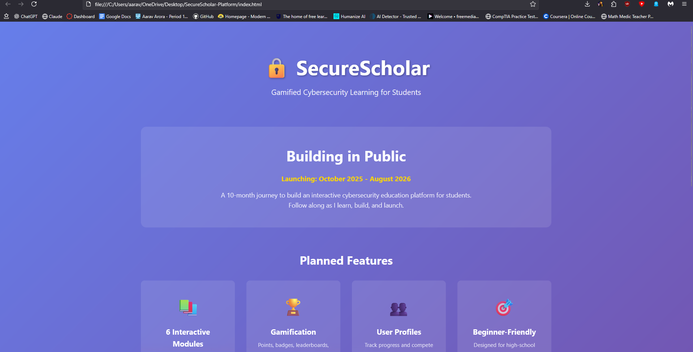
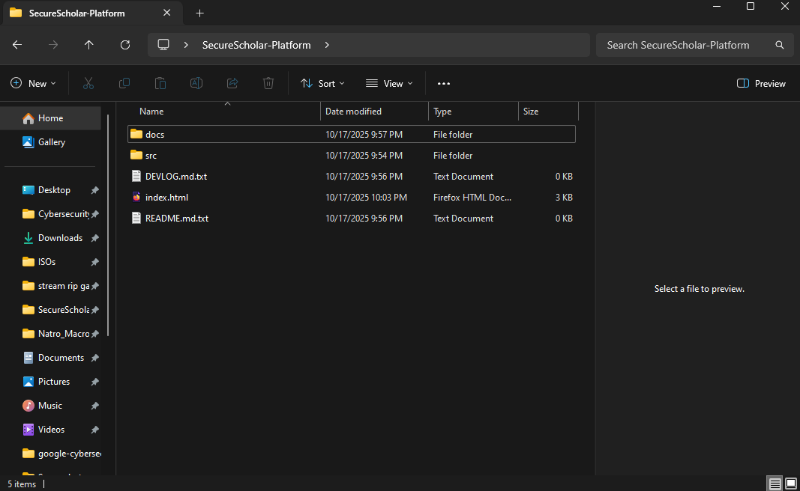
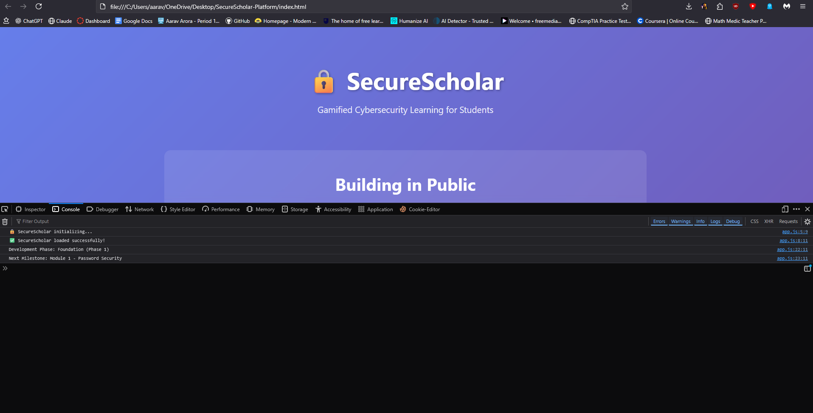

# SecureScholar Platform

**Status:**  Live (Phase 1 — Foundation)  
**Timeline:** October 2025 – August 2026  
**Live Demo:** https://securescholar.netlify.app/  
**Tech Stack:** HTML, CSS, JavaScript (Vanilla)

---

##  Vision

SecureScholar is a **gamified cybersecurity learning platform** built by Aarav Arora for high school students.  
Think *“Duolingo meets TryHackMe”* — interactive, fun, and beginner-friendly cybersecurity education.

This platform is developed publicly throughout Aarav’s **2025-2026 Cybersecurity Roadmap**, evolving across five phases of design, coding, and teaching.

---

##  Development Phases

### Phase 1: Foundation (Oct–Dec 2025)
- Landing page (HTML/CSS/JS)
- [ ] User authentication
- [ ] Module 1: Password Security
- [ ] Points + XP system

### Phase 2: Content Expansion (Jan–Feb 2026)
- [ ] Modules 2–4 (Phishing, Networks, Encryption)
- [ ] User Dashboard
- [ ] Basic progress tracking

### Phase 3: Gamification System (Mar–May 2026)
- [ ] Leaderboard + Achievements
- [ ] Weekly challenges
- [ ] Profile system

### Phase 4: Advanced Content & UX (May–Jun 2026)
- [ ] Web Security + Cryptography modules
- [ ] Mobile responsiveness upgrade
- [ ] UI refinement

### Phase 5: Launch & Outreach (Jul–Aug 2026)
- [ ] Final polish + testing
- [ ] Marketing and community rollout
- [ ] Public launch (Goal: 300 users)

---

## Tech Stack

| Category | Tools |
|-----------|-------|
| **Frontend** | HTML5 · CSS3 (Grid, Flexbox, Glassmorphism) · Vanilla JS |
| **Hosting** | Netlify Drop |
| **Version Control** | GitHub (for code + documentation) |
| **Design** | Figma · Canva (prototyping and visuals) |

---

##  Folder Structure

SecureScholar-Platform/
├── index.html
├── README.md
├── DEVLOG.md
│
├── src/
│ ├── css/
│ │ └── style.css
│ └── js/
│ └── app.js
│
└── Screenshots/
├── 2025-10-17_SecureScholar_Landing.png
├── 2025-10-17_Project_Folder_Tree.png
└── 2025-10-17_Browser_Console_OK.png

---

## Key Screenshots

| Screenshot | Description |
|-------------|--------------|
|  | Live landing page showcasing SecureScholar’s foundation. |
|  | Local project structure showing organized folders. |
|  | Browser Console logs confirm successful JavaScript execution. |

---

## Development Log

All week-by-week progress is recorded in [`DEVLOG.md`](DEVLOG.md).  
**Week 0 (Oct 17 2025)** marks the initial foundation and live deployment.  
Future entries will cover feature modules, UI improvements, and gamification.

---

## Reflections

- Learned to structure front-end projects properly using `/src` and `/docs`.  
- Deployed first site via Netlify Drop with custom domain.  
- Practiced HTML, CSS Grid, and responsive design principles.  
- Established base for 10-month cybersecurity education project.

---

## License

**MIT License** — you’re free to learn from this code and adapt it for educational purposes.  

